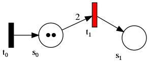

# plantuml-petrinets

> *"You love PlantUML and Petri Nets, and you want to draw Petri Nets in plantUML? This is for you :heart:"*

This is a small includable plantuml library for defining [Petri Nets](https://en.wikipedia.org/wiki/Petri_net) in [PlantUML](https://github.com/plantuml).
This library provides the following macros:

* `Place(name,as="",marking="",style="")`  
    creates a place with the given name and an optional alias, marking or style.
* `VTrans(name,as="",style="")`  
    creates a vertical transition with the given name and an optional alias or style
* `HTrans(name,as="",style="")`  
    creates a vertical transition with the given name and an optional alias or style
* `Arc(source,target,label="")`  
    creates a down/right arc from source to target with an optional label
* `UpArc(source,target,label="")`  
    creates a up/left arc from source to target with an optional label
* `SameArc(source,target,label="")`  
    creates an arc from source to target with an optional label not influencing the ranking of places and transitions
* `Token(number)`  
    creates a string of black circles as tokens
* `LeftToRight()`  
    changes the diagram direction from top down to left to right

It permits the simple definition of Petri Nets.

> **Note:** This library currently falls back to graphviz, hence all style options are provided via graphviz options rather than plantuml options.

# Possible Use

To use the library copy the library from this repository into your local folder. Then you can include it into a PlantUML file and use the commands to create your petri net. Please note, that in order for this to work, the macros must be placed within a `digraph` block.

Here is an example of a basic Petri Net:

```plantuml
@startuml
!include plantuml-petrinets.iuml

digraph G {

LeftToRight()

VTrans(t0)
Place(p1,_marking=Token(2))
VTrans(t1)
Place(p2)

Arc(t0,p1)
Arc(p1,t1,"2")
Arc(t1,p2)

}

@enduml
```

This Petri Net can be compiled as usual with Plantuml `java -jar plantuml.jar basic-petrinet.puml`.



You will find more examples in the [examples](examples/) folder.

> **Hint:** In the future there will be a release of the library, which can be included via an URL.

# Limitations

* Uses PlantUML's fallback to Graphviz
* It is currently impossible to color tokens
* Places and transitions can be styled both globally and individually. Please refere to the [Graphviz reference](https://graphviz.org/doc/info/attrs.html) for style options.
* If you want to contribute please read details on how the [plantUML's preprocessor](https://plantuml.com/en/preprocessing) works

# Version

0.1.0
